# pix2pix-tensorflow

Based on [pix2pix](https://phillipi.github.io/pix2pix/) by Isola et al.

[Article about this implemention](https://affinelayer.com/pix2pix/)

Tensorflow implementation of pix2pix.  Learns a mapping from input images to output images, like these examples from the original paper:


This port is based directly on the torch implementation, and not on an existing Tensorflow implementation.  It is meant to be a faithful implementation of the original work and so does not add anything.  The processing speed on a GPU with cuDNN was equivalent to the Torch implementation in testing.

## Setup

### Prerequisites
- Tensorflow 1.0.0

### Recommended
- Linux with Tensorflow GPU edition + cuDNN

### Getting Started

```sh
# clone this repo
git clone https://github.com/affinelayer/pix2pix-tensorflow.git
cd pix2pix-tensorflow
# download the CMP Facades dataset (generated from http://cmp.felk.cvut.cz/~tylecr1/facade/)
python tools/download-dataset.py facades
# train the model (this may take 1-8 hours depending on GPU, on CPU you will be waiting for a bit)
python pix2pix.py \
  --mode train \
  --output_dir facades_train \
  --max_epochs 200 \
  --input_dir facades/train \
  --which_direction BtoA
# test the model
python pix2pix.py \
  --mode test \
  --output_dir facades_test \
  --input_dir facades/val \
  --checkpoint facades_train
```

The test run will output an HTML file at `facades_test/index.html` that shows input/output/target image sets.

If you have Docker installed, you can use the provided Docker image to run pix2pix without installing the correct version of Tensorflow:

```sh
# train the model
python tools/dockrun.py python pix2pix.py \
      --mode train \
      --output_dir facades_train \
      --max_epochs 200 \
      --input_dir facades/train \
      --which_direction BtoA
# test the model
python tools/dockrun.py python pix2pix.py \
      --mode test \
      --output_dir facades_test \
      --input_dir facades/val \
      --checkpoint facades_train
```

## Datasets and Trained Models

The data format used by this program is the same as the original pix2pix format, which consists of images of input and desired output side by side like:


For example:


Some datasets have been made available by the authors of the pix2pix paper.  To download those datasets, use the included script `tools/download-dataset.py`.  There are also links to pre-trained models alongside each dataset, note that these pre-trained models require the Tensorflow 0.12.1 version of pix2pix.py since they have not been regenerated with the 1.0.0 release:

| dataset | example |
| --- | --- |
| `python tools/download-dataset.py facades` <br> 400 images from [CMP Facades dataset](http://cmp.felk.cvut.cz/~tylecr1/facade/). (31MB) <br> Pre-trained: [BtoA](https://mega.nz/#!2xpyQBoK!GVtkZN7lqY4aaZltMFdZsPNVE6bUsWyiVUN6RwJtIxQ)  |  |
| `python tools/download-dataset.py cityscapes` <br> 2975 images from the [Cityscapes training set](https://www.cityscapes-dataset.com/). (113M) <br> Pre-trained: [AtoB](https://mega.nz/#!rxByxK6S!W9ZBUqgdGTFDWVlOE_ljVt1G3bU89bdu_nS9Bi1ujiA) [BtoA](https://mega.nz/#!b1olDbhL!mxsYC5AF_WH64CXoukN0KB-nw15kLQ0Etii-F-HDTps) | 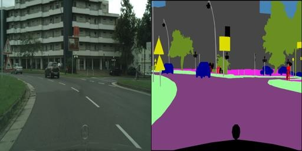 |
| `python tools/download-dataset.py maps` <br> 1096 training images scraped from Google Maps (246M) <br> Pre-trained: [AtoB](https://mega.nz/#!i8pkkBJT!3NKLar9sUr-Vh_vNVQF-xwK9-D9iCqaCmj1T27xRf4w) [BtoA](https://mega.nz/#!r8xwCBCD!lNBrY_2QO6pyUJziGj7ikPheUL_yXA8xGXFlM3GPL3c) |  |
| `python tools/download-dataset.py edges2shoes` <br> 50k training images from [UT Zappos50K dataset](http://vision.cs.utexas.edu/projects/finegrained/utzap50k/). Edges are computed by [HED](https://github.com/s9xie/hed) edge detector + post-processing. (2.2GB) <br> Pre-trained: [AtoB](https://mega.nz/#!OoYT3QiQ!8y3zLESvhOyeA6UsjEbcJphi3_uEt534waSL5_f_D4Y) | 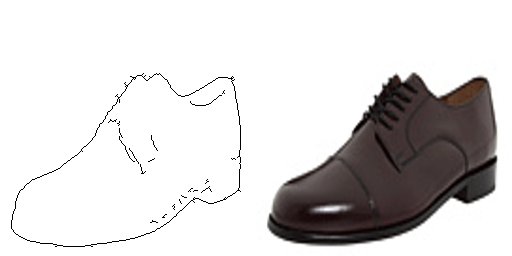  |
| `python tools/download-dataset.py edges2handbags` <br> 137K Amazon Handbag images from [iGAN project](https://github.com/junyanz/iGAN). Edges are computed by [HED](https://github.com/s9xie/hed) edge detector + post-processing. (8.6GB) <br> Pre-trained: [AtoB](https://mega.nz/#!KlpBHKrZ!iJ3x6xzgk0wnJkPiAf0UxPzhYSmpC3kKH1DY5n_dd0M) | 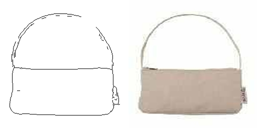 |

The `facades` dataset is the smallest and easiest to get started with.

### Creating your own dataset

#### Example: creating images with blank centers for [inpainting](https://people.eecs.berkeley.edu/~pathak/context_encoder/)

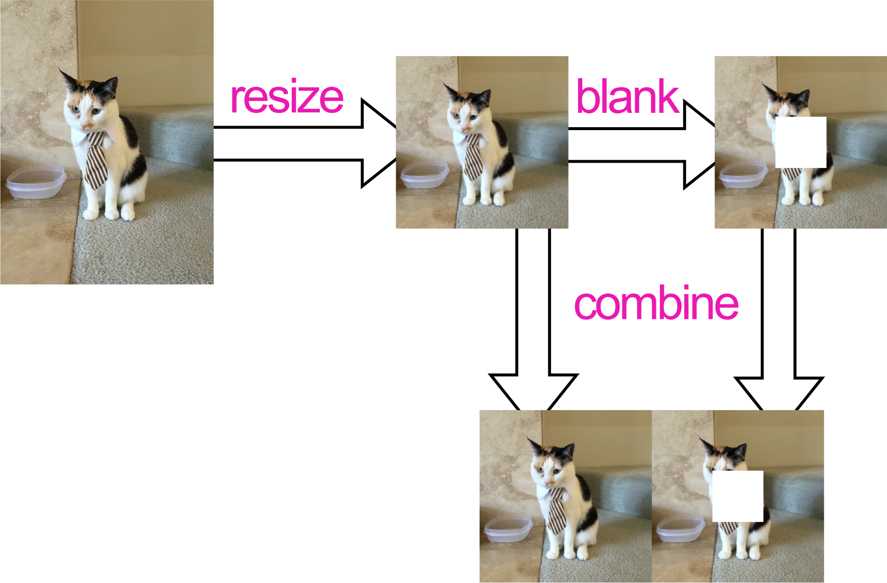

```sh
# Resize source images
python tools/process.py \
  --input_dir photos/original \
  --operation resize \
  --output_dir photos/resized
# Create images with blank centers
python tools/process.py \
  --input_dir photos/resized \
  --operation blank \
  --output_dir photos/blank
# Combine resized images with blanked images
python tools/process.py \
  --input_dir photos/resized \
  --b_dir photos/blank \
  --operation combine \
  --output_dir photos/combined
# Split into train/val set
python tools/split.py \
  --dir photos/combined
```

The folder `photos/combined` will now have `train` and `val` subfolders that you can use for training and testing.

#### Creating image pairs from existing images

If you have two directories `a` and `b`, with corresponding images (same name, same dimensions, different data) you can combine them with `process.py`:

```sh
python tools/process.py \
  --input_dir a \
  --b_dir b \
  --operation combine \
  --output_dir c
```

This puts the images in a side-by-side combined image that `pix2pix.py` expects.

#### Colorization

For colorization, your images should ideally all be the same aspect ratio.  You can resize and crop them with the resize command:
```sh
python tools/process.py \
  --input_dir photos/original \
  --operation resize \
  --output_dir photos/resized
```

No other processing is required, the colorization mode (see Training section below) uses single images instead of image pairs.

## Training

### Image Pairs

For normal training with image pairs, you need to specify which directory contains the training images, and which direction to train on.  The direction options are `AtoB` or `BtoA`
```sh
python pix2pix.py \
  --mode train \
  --output_dir facades_train \
  --max_epochs 200 \
  --input_dir facades/train \
  --which_direction BtoA
```

### Colorization

`pix2pix.py` includes special code to handle colorization with single images instead of pairs, using that looks like this:

```sh
python pix2pix.py \
  --mode train \
  --output_dir photos_train \
  --max_epochs 200 \
  --input_dir photos/train \
  --lab_colorization
```

In this mode, image A is the black and white image (lightness only), and image B contains the color channels of that image (no lightness information).

### Tips

You can look at the loss and computation graph using tensorboard:
```sh
tensorboard --logdir=facades_train
```

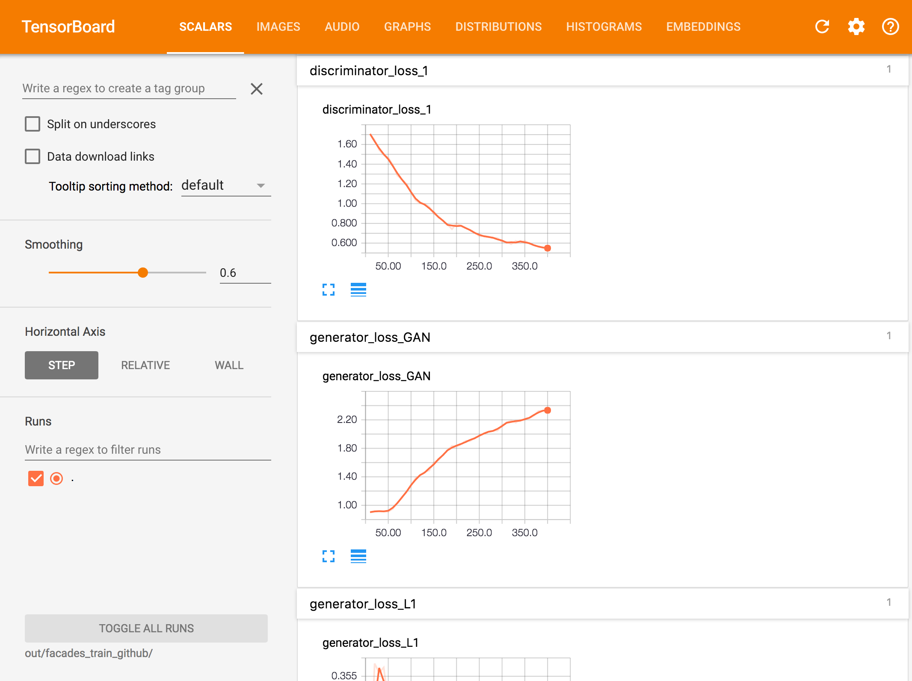 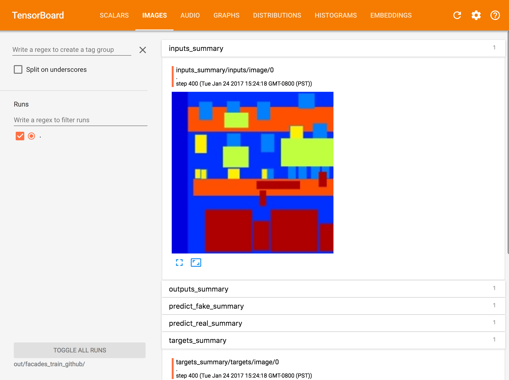 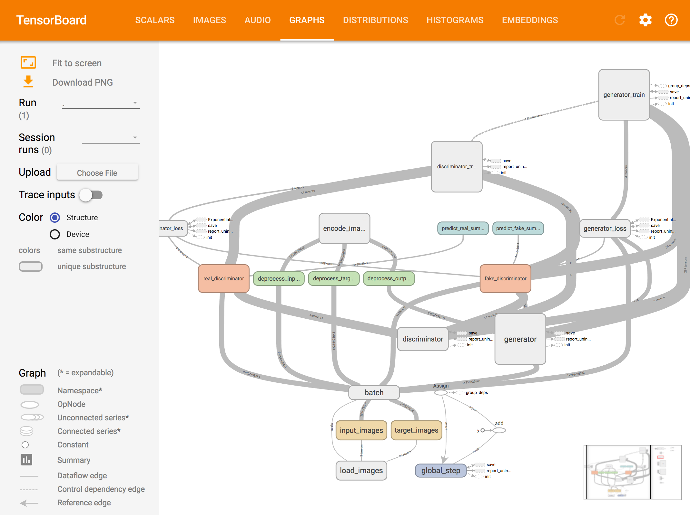

If you wish to write in-progress pictures as the network is training, use `--display_freq 50`.  This will update `facades_train/index.html` every 50 steps with the current training inputs and outputs.

## Testing

Testing is done with `--mode test`.  You should specify the checkpoint to use with `--checkpoint`, this should point to the `output_dir` that you created previously with `--mode train`:

```sh
python pix2pix.py \
  --mode test \
  --output_dir facades_test \
  --input_dir facades/val \
  --checkpoint facades_train
```

The testing mode will load some of the configuration options from the checkpoint provided so you do not need to specify `which_direction` for instance.

The test run will output an HTML file at `facades_test/index.html` that shows input/output/target image sets:


## Code Validation

Validation of the code was performed on a Linux machine with a ~1.3 TFLOPS Nvidia GTX 750 Ti GPU and an Azure NC6 instance with a K80 GPU.

```sh
git clone https://github.com/affinelayer/pix2pix-tensorflow.git
cd pix2pix-tensorflow
python tools/download-dataset.py facades
sudo nvidia-docker run \
  --volume $PWD:/prj \
  --workdir /prj \
  --env PYTHONUNBUFFERED=x \
  affinelayer/pix2pix-tensorflow \
    python pix2pix.py \
      --mode train \
      --output_dir facades_train \
      --max_epochs 200 \
      --input_dir facades/train \
      --which_direction BtoA
sudo nvidia-docker run \
  --volume $PWD:/prj \
  --workdir /prj \
  --env PYTHONUNBUFFERED=x \
  affinelayer/pix2pix-tensorflow \
    python pix2pix.py \
      --mode test \
      --output_dir facades_test \
      --input_dir facades/val \
      --checkpoint facades_train
```

Comparison on facades dataset:

| Input | Tensorflow | Torch | Target |
| --- | --- | --- | --- |
| 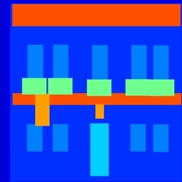 | 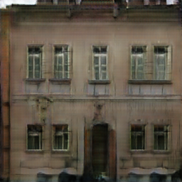 | 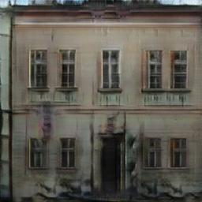 | 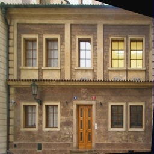 |
| 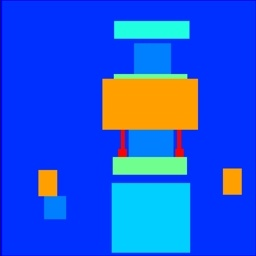 | 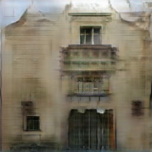 | 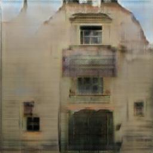 |  |
| 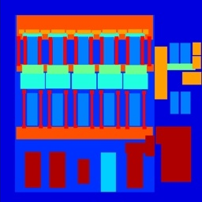 | 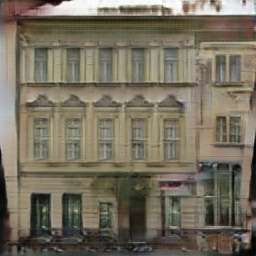 | 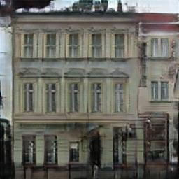 | 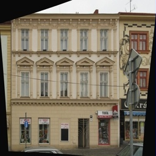 |
| 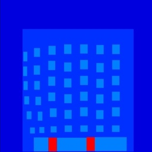 | 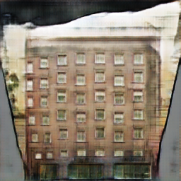 | 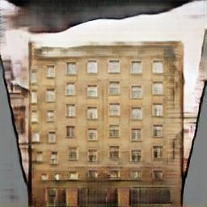 | 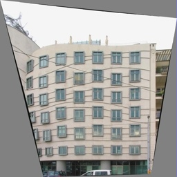 |

## Unimplemented Features

The following models have not been implemented:
- defineG_encoder_decoder
- defineG_unet_128
- defineD_pixelGAN

## Citation
If you use this code for your research, please cite the paper this code is based on: <a href="https://arxiv.org/pdf/1611.07004v1.pdf">Image-to-Image Translation Using Conditional Adversarial Networks</a>:

```
@article{pix2pix2016,
  title={Image-to-Image Translation with Conditional Adversarial Networks},
  author={Isola, Phillip and Zhu, Jun-Yan and Zhou, Tinghui and Efros, Alexei A},
  journal={arxiv},
  year={2016}
}
```

## Acknowledgments
This is a port of [pix2pix](https://github.com/phillipi/pix2pix) from Torch to Tensorflow.  It also contains colorspace conversion code ported from Torch.  Thanks to the Tensorflow team for making such a quality library!  And special thanks to Phillip Isola for answering my questions about the pix2pix code.
